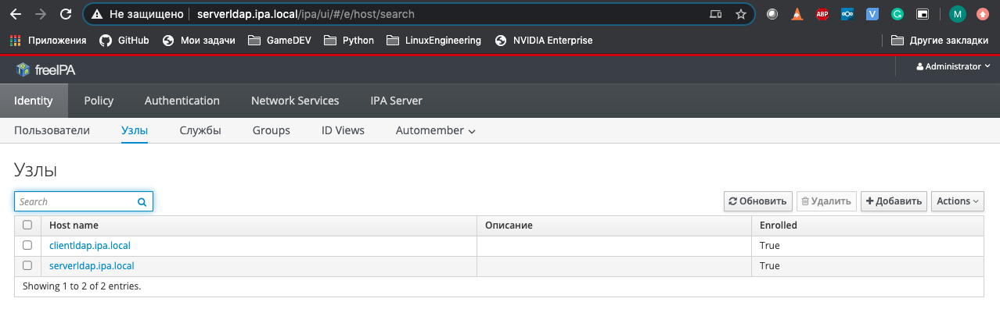
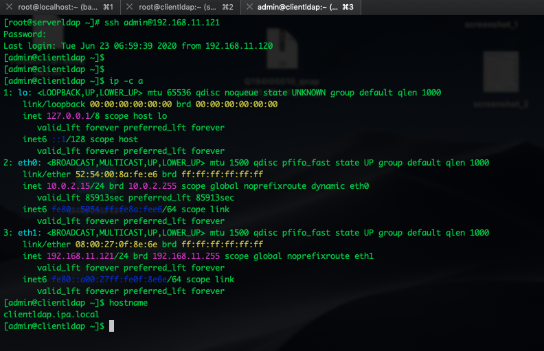

### Install FreeIPA server, and connect FreeIPA client

Разворачиваем стэнд:

``` bash
vagrant up
```
Получаем 2 машины для тестового стэнда:
* serverldap
* clientldap

Для установки FreeIPA сервера, необходимо запустить сценарий ansible.

``` bash
ansible-playbook playbooks/prep_LDAP_stand.yml
```
После завершения работы сценария, получим рабочий сервер FreeIPA, с запущенным firewalld и готовым для подключения FreeIPA клиентов. Так же в процессе работы сценария запускается firewalld и на клиент машине.

Для установки и настройки FreeIPA клиент запускаем следующий сценарий ansible:

``` bash
ansible-playbook playbooks/clientldap.yml
```
В процессе работы сценария заменяется resolv.conf, для использования ранее настроенного DNS, на serverldap. Так же происходит конфигурирование FreeIPA клиента.

После завершения работы обоих сценариев, можно перейти через веб браузер на serverldap.  
Предварительно небходимо внести адрес и хостнейм в файл hosts на локальной машине(в нашем случае это будет выглядеть так):
```bash
echo "192.168.11.120  serverldap.ipa.local" >> /etc/hosts
```
Переходим на страницу https://serverldap.ipa.local, проходим авторизацию:
```
login: admin
pass: vagrant123
```
Затем переходим на вкладку Identity -> Узлы и видим добавленый сервер clientldap.ipa.local



Затем проверяем авторизацию, заходим с serverldap на clientldap по ssh под пользователем admin.


